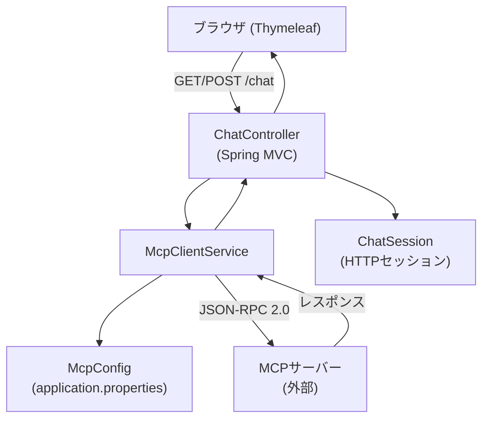
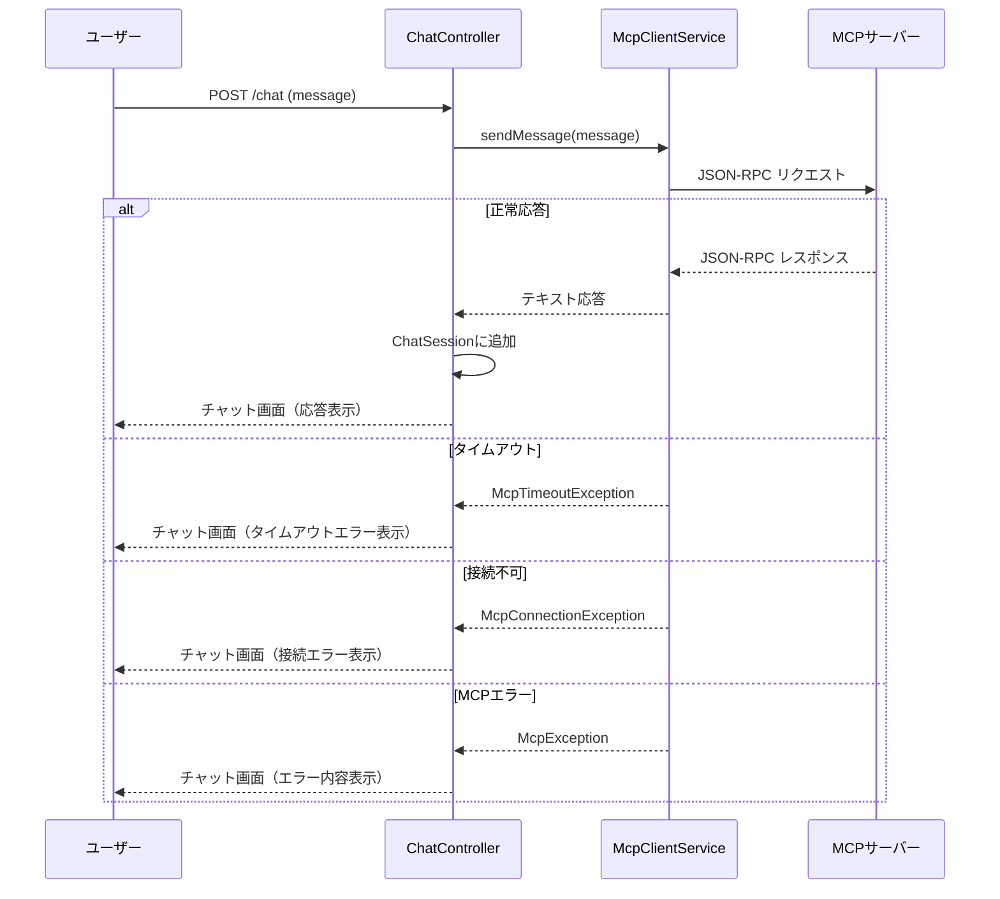

# 設計書: mcp-chat-webapp

## 概要

本設計書は、Spring Boot 4.0.3 / Java 25 / Thymeleaf / Spring MVC を用いて構築する「MCPチャットWebアプリ」の技術設計を定義する。

ユーザーはブラウザ上のチャット画面からメッセージを入力し、設定済みのMCPサーバー（Model Context Protocol）に接続して応答を受け取り、結果を画面に表示する。

### 技術スタック

| 項目 | 内容 |
|------|------|
| フレームワーク | Spring Boot 4.0.3 |
| 言語 | Java 25 |
| ビルドツール | Gradle |
| テンプレートエンジン | Thymeleaf |
| パッケージ | com.github.miyohide.mymcp |
| プロトコル | MCP（JSON-RPC 2.0ベース） |

---

## アーキテクチャ

### 全体構成



### レイヤー構成

```
プレゼンテーション層  : Thymeleafテンプレート (chat.html)
コントローラー層      : ChatController
サービス層            : McpClientService
設定層                : McpConfig
セッション層          : ChatSession
```

---

## コンポーネントとインターフェース

### ChatController

`/chat` エンドポイントを処理するSpring MVCコントローラー。

```java
@Controller
public class ChatController {

    // GET /chat - チャット画面を表示
    @GetMapping("/chat")
    public String showChat(Model model, HttpSession session) { ... }

    // POST /chat - メッセージを送信して応答を表示
    @PostMapping("/chat")
    public String sendMessage(@RequestParam String message,
                              Model model, HttpSession session) { ... }

    // POST /chat/clear - 会話履歴をクリア
    @PostMapping("/chat/clear")
    public String clearHistory(HttpSession session) { ... }
}
```

### McpClientService

MCPサーバーへの接続・通信を担当するサービスクラス。

```java
@Service
public class McpClientService {

    // アプリ起動時にMCPサーバーへinitializeリクエストを送信
    @PostConstruct
    public void initialize() { ... }

    // ユーザーメッセージをMCPサーバーに送信し、テキスト応答を返す
    public String sendMessage(String message) { ... }
}
```

### McpConfig

`application.properties` からMCPサーバー接続設定を読み込む設定クラス。

```java
@ConfigurationProperties(prefix = "mcp.server")
@Validated
public class McpConfig {
    @NotBlank
    private String url;
    private int connectionTimeout = 5000;  // デフォルト: 5000ms
    private int readTimeout = 30000;       // デフォルト: 30000ms
}
```

### ChatSession

HTTPセッションスコープで管理される会話履歴オブジェクト。

```java
@Component
@SessionScope
public class ChatSession {
    private List<ChatMessage> messages = new ArrayList<>();

    public void addMessage(String userMessage, String botResponse) { ... }
    public List<ChatMessage> getMessages() { ... }
    public void clear() { ... }
}
```

### Thymeleafテンプレート (chat.html)

- メッセージ入力フォーム（Enterキー送信対応）
- 送信ボタン（送信中は無効化）
- 会話履歴エリア（ユーザー/MCPサーバーを視覚的に区別）
- エラーメッセージ表示エリア

---

## データモデル

### ChatMessage

会話履歴の1エントリを表すレコード。

```java
public record ChatMessage(
    String userMessage,   // ユーザーが入力したメッセージ
    String botResponse,   // MCPサーバーからの応答（エラー時はエラーメッセージ）
    LocalDateTime timestamp,  // 送信日時
    boolean isError       // エラーフラグ
) {}
```

### MCPリクエスト/レスポンス（JSON-RPC 2.0）

**initializeリクエスト:**
```json
{
  "jsonrpc": "2.0",
  "id": 1,
  "method": "initialize",
  "params": {
    "protocolVersion": "2024-11-05",
    "clientInfo": { "name": "mymcp", "version": "0.0.1" }
  }
}
```

**tools/callリクエスト:**
```json
{
  "jsonrpc": "2.0",
  "id": 2,
  "method": "tools/call",
  "params": {
    "name": "chat",
    "arguments": { "message": "ユーザーのメッセージ" }
  }
}
```

**レスポンス:**
```json
{
  "jsonrpc": "2.0",
  "id": 2,
  "result": {
    "content": [{ "type": "text", "text": "MCPサーバーからの応答" }]
  }
}
```

### application.properties 設定項目

```properties
mcp.server.url=http://localhost:8080
mcp.server.connection-timeout=5000
mcp.server.read-timeout=30000
```

---

## 正確性プロパティ

*プロパティとは、システムのすべての有効な実行において成立すべき特性や振る舞いのことである。形式的に言えば、システムが何をすべきかについての命題である。プロパティは人間が読める仕様と機械で検証可能な正確性保証の橋渡しをする。*


### プロパティ1: メッセージ追加後の会話履歴順序保持

*任意の* ChatSessionに対して、メッセージを追加した順序と `getMessages()` で取得した順序が一致する

**検証対象: 要件 1.5, 6.2, 6.4**

### プロパティ2: 空・空白メッセージの拒否

*任意の* 空文字列または空白のみで構成された文字列をメッセージとして送信した場合、McpClientServiceは呼び出されず、ChatSessionのメッセージ数は変化しない

**検証対象: 要件 2.5**

### プロパティ3: 応答のChatSessionへの追加

*任意の* ユーザーメッセージとMCPサーバー応答のペアに対して、ChatControllerがChatSessionに追加した後、最後のエントリがそのペアと一致する

**検証対象: 要件 2.3**

### プロパティ4: ユーザーメッセージとボット応答の視覚的区別

*任意の* ChatMessageリストに対して、レンダリングされたHTMLにおいてユーザーメッセージとMCPサーバー応答が異なるCSSクラスで表示される

**検証対象: 要件 2.4, 7.5**

### プロパティ5: JSON-RPC 2.0形式のリクエスト送信

*任意の* ユーザーメッセージに対して、McpClientServiceが送信するリクエストは `jsonrpc: "2.0"`、`method`、`id`、`params` フィールドを含む有効なJSON-RPC 2.0形式である

**検証対象: 要件 4.1, 4.3**

### プロパティ6: MCPレスポンスのテキスト変換

*任意の* MCPサーバーレスポンスに対して、`content[].text` フィールドの値が結合されたテキストとして返される

**検証対象: 要件 4.4**

### プロパティ7: 例外発生時のエラー表示とフォーム維持

*任意の* 例外がMcpClientServiceからスローされた場合、チャット画面にエラーメッセージが表示され、かつメッセージ入力フォームが引き続き使用可能な状態で表示される

**検証対象: 要件 5.1, 5.5**

---

## エラーハンドリング

### エラー種別と対応

| エラー種別 | 原因 | ユーザーへの表示メッセージ | ログ出力 |
|-----------|------|--------------------------|---------|
| 接続タイムアウト | `SocketTimeoutException` | MCPサーバーへの接続がタイムアウトしました | スタックトレース |
| 接続不可 | `ConnectException` | MCPサーバーに接続できません。設定を確認してください。 | スタックトレース |
| MCPエラーレスポンス | JSON-RPCエラーオブジェクト | MCPサーバーからエラーが返されました: {エラーメッセージ} | スタックトレース |
| 設定エラー | `mcp.server.url` 未設定 | 起動時にエラーログを出力して起動中断 | エラーメッセージ |
| 予期しない例外 | その他の例外 | 予期しないエラーが発生しました | スタックトレース |

### エラーハンドリングフロー



### カスタム例外クラス

```java
// MCPサーバー通信に関する基底例外
public class McpException extends RuntimeException { ... }

// 接続タイムアウト
public class McpTimeoutException extends McpException { ... }

// 接続不可
public class McpConnectionException extends McpException { ... }
```

---

## テスト戦略

### 方針

ユニットテストとプロパティベーステストの両方を採用する。

- **ユニットテスト**: 特定の例、エッジケース、エラー条件を検証する
- **プロパティベーステスト**: すべての入力に対して成立すべき普遍的プロパティを検証する

両者は補完的であり、ユニットテストは具体的なバグを捕捉し、プロパティテストは一般的な正確性を検証する。

### プロパティベーステストライブラリ

Java 25 + JUnit 5 環境では **jqwik** を使用する。

```gradle
testImplementation 'net.jqwik:jqwik:1.9.0'
```

各プロパティテストは最低100回のイテレーションを実行する（jqwikのデフォルト: 1000回）。

### テスト対象と種別

#### ChatSession（ユニット + プロパティ）

| テスト | 種別 | 対応プロパティ |
|--------|------|--------------|
| メッセージ追加後の順序確認 | プロパティ | プロパティ1 |
| clear()後にリストが空になる | ユニット | 要件6.5 |
| 複数セッションの独立性 | ユニット | 要件6.1 |

#### ChatController（ユニット + プロパティ）

| テスト | 種別 | 対応プロパティ |
|--------|------|--------------|
| GET /chat が200を返す | ユニット | 要件1.1 |
| チャット画面の必須UI要素確認 | ユニット | 要件1.2, 1.3, 1.4 |
| 空メッセージでサービス未呼び出し | プロパティ | プロパティ2 |
| 応答のChatSession追加確認 | プロパティ | プロパティ3 |
| 例外時のエラー表示とフォーム維持 | プロパティ | プロパティ7 |
| タイムアウト時の特定メッセージ表示 | ユニット（エッジケース） | 要件5.2 |
| 接続不可時の特定メッセージ表示 | ユニット（エッジケース） | 要件5.3 |

#### McpClientService（ユニット + プロパティ）

| テスト | 種別 | 対応プロパティ |
|--------|------|--------------|
| JSON-RPC 2.0形式のリクエスト確認 | プロパティ | プロパティ5 |
| MCPレスポンスのテキスト変換 | プロパティ | プロパティ6 |
| 起動時のinitializeリクエスト送信 | ユニット | 要件4.2 |
| 接続失敗時の例外スロー | ユニット（エッジケース） | 要件4.5 |
| エラーレスポンス時の例外スロー | ユニット（エッジケース） | 要件4.6 |

#### McpConfig（ユニット）

| テスト | 種別 | 対応プロパティ |
|--------|------|--------------|
| 設定値の正常読み込み | ユニット | 要件3.1, 3.2, 3.3 |
| URL未設定時の起動失敗 | ユニット（エッジケース） | 要件3.4 |
| タイムアウトのデフォルト値確認 | ユニット（エッジケース） | 要件3.5, 3.6 |

#### Thymeleafテンプレート（ユニット + プロパティ）

| テスト | 種別 | 対応プロパティ |
|--------|------|--------------|
| ユーザー/ボットの視覚的区別確認 | プロパティ | プロパティ4 |
| 空履歴時の表示確認 | ユニット | 要件1.6 |

### プロパティテストのタグ形式

各プロパティテストには以下の形式でコメントを付与する:

```
// Feature: mcp-chat-webapp, Property {番号}: {プロパティ内容}
```

例:
```java
// Feature: mcp-chat-webapp, Property 1: メッセージ追加後の会話履歴順序保持
@Property
void messageOrderIsPreserved(@ForAll List<@From("chatMessages") ChatMessage> messages) {
    // ...
}
```
